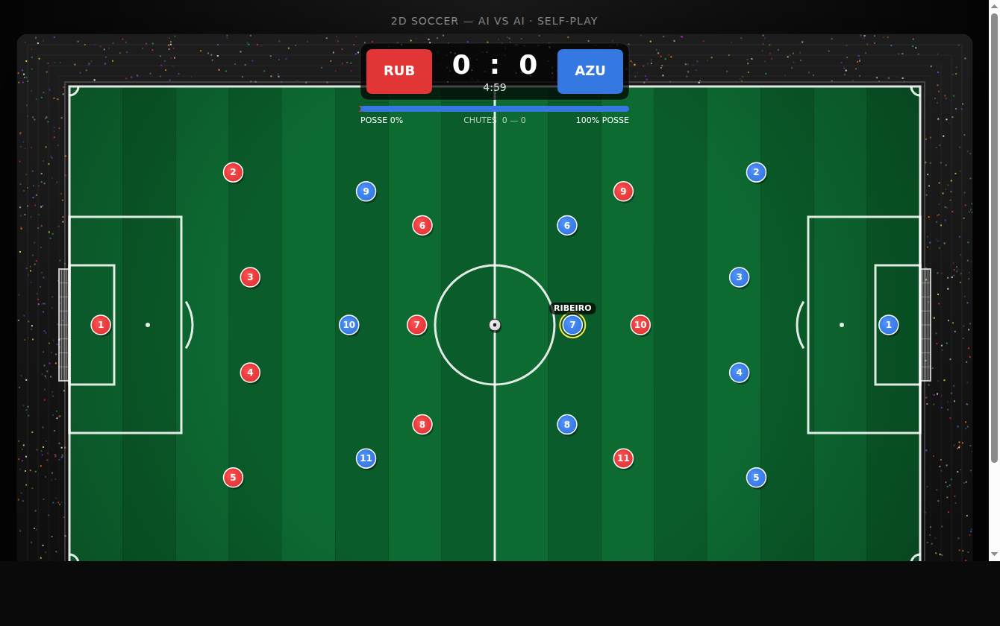

# 2D Soccer — AI vs AI

Simulador de futebol top-down 2D em **HTML + Canvas puro**, sem dependências, sem build, sem servidor. Os 22 jogadores são todos controlados por IA — você só assiste.

Inspirado [neste tweet](https://twitter.com/soya_da_yoot) onde o autor pediu ao Codex pra construir um simulador 2D que jogasse sozinho "até ficar divertido de assistir".



## Como rodar

Não precisa instalar nada. Tem três opções:

```bash
# 1) Abrir o arquivo direto
xdg-open index.html        # linux
open index.html            # mac

# 2) Servidor local simples (recomendado)
python3 -m http.server 8765
# e abre http://localhost:8765

# 3) Qualquer host estático (GitHub Pages, Netlify, Vercel, etc)
```

## Features

**Gameplay**
- 11 vs 11 com formação 4-3-3 (GK / 4 DEF / 3 MID / 3 FWD)
- IA com papéis: o mais próximo da bola persegue, demais mantêm formação com bias de posse
- Tomada de decisão: **chutar** (se em alcance e linha livre) → **passar** (procura companheiro mais avançado com lane livre) → **driblar**
- Goleiro acompanha o eixo Y da bola e se adianta levemente quando ela se aproxima
- Press defensivo gradual proporcional à distância
- Inércia nos jogadores (movimento suavizado, sem snap de direção)

**Visual & "juice"**
- Listras de grama, vinheta, áreas, marca penal, escanteios, redes
- Estádio com 4500 pontinhos coloridos simulando torcida
- Screen shake em gols e chutes
- Partículas: kick-burst em toques, **confetes coloridos** no gol
- Rastro da bola
- Squash & stretch nos jogadores na hora do toque
- Indicador de posse (anel amarelo no jogador com a bola)
- Nome do jogador flutuando acima de quem tem a posse

**Transmissão / TV**
- Placar central com siglas dos times em blocos coloridos
- Barra de **posse de bola** em tempo real
- Contador de **chutes** por time
- Toasts de narração: `CHUTOU!`, `LANÇAMENTO!`, `GOOOL — RUBRO!`

**Replay automático em câmera lenta**
- Buffer de 3s gravado a cada frame
- Todo gol dispara replay a 0.45× com scanlines + label `REPLAY · espaço pula`
- Skip a qualquer momento com `espaço` ou click

**Áudio procedural (Web Audio API, zero asset)**
- Torcida ambiente em loop (ruído rosa filtrado)
- Grito coletivo no gol
- Apito de início/fim
- Som de chute e finalização

## Controles

| Tecla | Ação |
|-------|------|
| `espaço` | Pausa / pula replay |
| `R` | Reinicia partida |
| `+` / `-` | Aumenta / diminui velocidade (0.5× a 4×) |
| `M` | Mute |
| `P` | Replay manual dos últimos 3 segundos |
| click | Ativa áudio + pula replay |

## Stack

- **HTML + Canvas 2D + JS vanilla** — um único arquivo `index.html`, ~750 linhas
- Sem framework, sem build step, sem `node_modules`
- Web Audio API pra todo o som (sem arquivos de áudio)
- Tudo pré-renderizado em `<canvas>` — torcida cacheada num canvas offscreen

Decisão consciente de não usar Three.js ou PixiJS: pra um jogo top-down 2D simples, Canvas 2D é a ferramenta mais leve e direta. O arquivo todo são ~24KB.

## Roadmap

Coisas que dariam mais sabor:
- [ ] Set pieces: escanteio, lateral, cobrança de falta
- [ ] Stamina e variação de habilidade entre jogadores
- [ ] Heatmap de posse ao final do jogo
- [ ] Botão "compartilhar clipe" (export do replay como WebM)
- [ ] Customização de cores/nomes dos times
- [ ] Mobile touch support

PRs bem-vindos.

## Origem

Construído iterativamente no Claude Code seguindo o espírito do tweet original: jogar até ficar divertido. A primeira versão tinha 4v4, controle humano e estética crua. A versão atual é IA pura, 11v11, com camadas de polish (replay, áudio, partículas, transmissão) descobertas a cada partida que parecia "morta" demais pra valer assistir.

## Licença

MIT — usa, forka, modifica, faz o que quiser.
